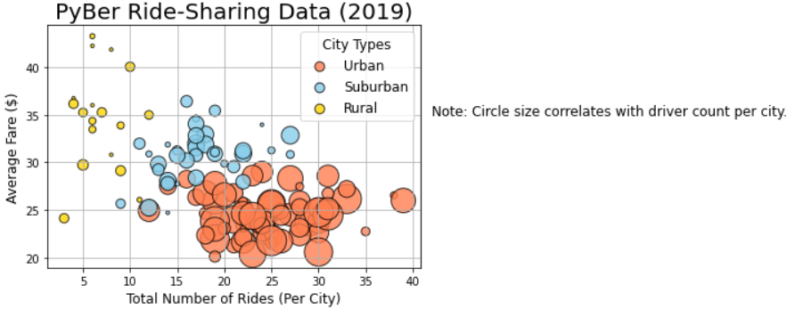
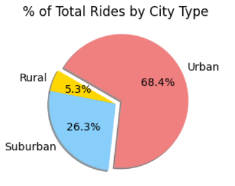
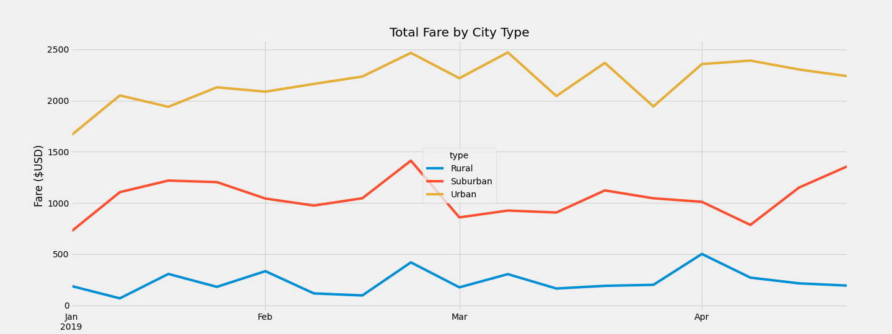

# PyBer Ride-Sharing Analysis

## Overview
PyBer Ride-sharing has requested an analysis of their 2019 ride-sharing data. This analysis requires:
- A summary DataFrame that includes
  - total rides,
  - total drivers,
  - total fares,
  - average rides, fares and drivers by city types
- Graphs to visualize the data
- A report that provides recommendations to the CEO on how the data might assist in decision-making.

## Resources
The analysis is built using Python in Jupyter Notebook. Three data files are provided for the analysis, and are located in the <a href="https://https://github.com/TeresaWehmeier/PyBer_Analysis/tree/main/Resources/">Resources folder</a>. MATPLOTLIB module is used to develop the graphs.

## Results
PyBer Ride-Share serves 120 cities, 55% of which are urban, while 30% are suburban and the remaining 15% are rural cities. There are 2375 rides recorded between 1/1/2019 and 5/28/2019. As expected, urban cities deliver the most rides, 1625 according to the data, or 68% of all rides. Urban cities also employee the highest number of drivers with 2405 (80%) of the 2973 employed by PyBer working within urban areas. The scatterplot below shows the ride-share distribution based on city type and number of rides, with circle size correlating to driver number per city.

### Scatterplot Describing Rides by City Type

However, as the table below suggests, driver supply in urban cities exceeds current demand for rides in these cities.

### DataFrame Summary Table by City Type

Comparing distribution of drivers, rides and fares by city types in simple pie charts reflects what the table above reveals, that urban driver distribution does not reflect similar distributions in fares and rides. Urban drivers represent 80% of driver distribution but only make up 68% of rides and 62% of fares.

### Pie Charts Comparing Drivers, Fare and Ride Distribution

      

Average fare per ride for rural cities is just under $35 per ride, while suburban fare per ride is almost $31 per ride. However, urban average fare per ride is under $25. Average fare per driver for rural drivers is over $55 per driver and for suburban cities $39.50; but urban fare per driver is less than $17 per driver. These averages suggest a supply and demand issue; urban areas have more drivers available than rides. Urban cities have over 2400 drivers available, but delivered only 1625 rides in the first five months of 2019. Rural cities make up very few of the overall rides provided but are able to charge more per ride because driver competition is lower, which suggest the drivers are appropriate for the demand. The same is true for suburban cities, where the drivers make up 78% of rides. 

### Box-and-whisker Charts Average Fare per Ride and per Driver

### Weekly Fare Revenue by City Type

Describe differences in ride-sharing data including total rides, fares and drivers. Avg fare per ride and driver, and total fare by city type.

## Summary
Statement summarizing three business recommendations to the CEO for addressing any disparities among the city types.
